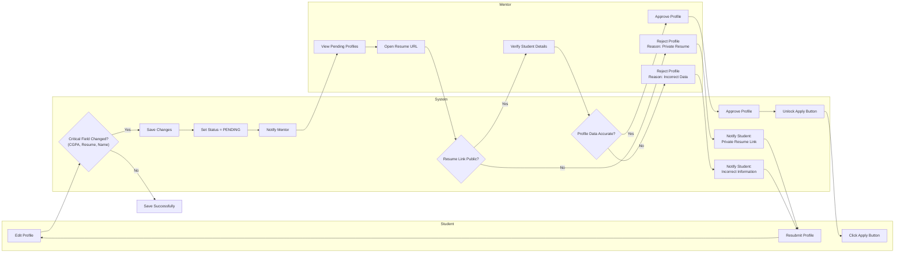
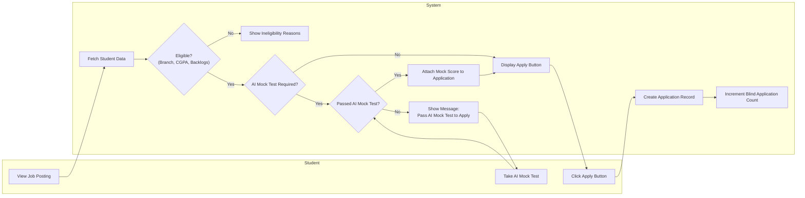

# DOCUMENT 11: Activity Diagrams

*Rendered using Mermaid.js syntax.*

**Diagram 1: Student Profile Update & Approval Activity**

```mermaid
flowchart LR

    %% ===========================
    %% Student
    %% ===========================
    subgraph Student
        EditProfile["Edit Profile"]
        Resubmit["Resubmit Profile"]
        ClickApply["Click Apply Button"]
    end

    %% ===========================
    %% System
    %% ===========================
    subgraph System
        CheckField{"Critical Field Changed?<br/>(CGPA, Resume, Name)"}
        Save["Save Changes"]
        SetPending["Set Status = PENDING"]
        NotifyMentor["Notify Mentor"]

        CheckLink{"Resume Link Public?"}
        NotifyRejection1["Notify Student:<br/>Private Resume Link"]

        CheckData{"Profile Data Accurate?"}
        NotifyRejection2["Notify Student:<br/>Incorrect Information"]

        Approve["Approve Profile"]
        Unlock["Unlock Apply Button"]
    end

    %% ===========================
    %% Mentor
    %% ===========================
    subgraph Mentor
        ViewPending["View Pending Profiles"]
        ClickURL["Open Resume URL"]
        VerifyDetails["Verify Student Details"]
        RejectPrivate["Reject Profile<br/>Reason: Private Resume"]
        RejectInaccurate["Reject Profile<br/>Reason: Incorrect Data"]
        ClickApprove["Approve Profile"]
    end

    %% Student edits profile
    EditProfile --> CheckField

    %% Critical fields changed
    CheckField -->|Yes| Save
    Save --> SetPending
    SetPending --> NotifyMentor

    %% Non-critical changes
    CheckField -->|No| SaveOnly["Save Successfully"]

    %% Mentor review
    NotifyMentor --> ViewPending
    ViewPending --> ClickURL
    ClickURL --> CheckLink

    %% Resume private
    CheckLink -->|No| RejectPrivate
    RejectPrivate --> NotifyRejection1
    NotifyRejection1 --> Resubmit
    Resubmit --> EditProfile

    %% Resume public
    CheckLink -->|Yes| VerifyDetails
    VerifyDetails --> CheckData

    %% Incorrect profile
    CheckData -->|No| RejectInaccurate
    RejectInaccurate --> NotifyRejection2
    NotifyRejection2 --> Resubmit

    %% Approved
    CheckData -->|Yes| ClickApprove
    ClickApprove --> Approve
    Approve --> Unlock
    Unlock --> ClickApply
```

**Diagram 2: Job Application & Eligibility Check Activity**

```mermaid
flowchart LR

    %% ===========================
    %% Student
    %% ===========================
    subgraph Student
        ViewJob["View Job Posting"]
        TakeMock["Take AI Mock Test"]
        ClickApply["Click Apply Button"]
    end

    %% ===========================
    %% System
    %% ===========================
    subgraph System
        FetchData["Fetch Student Data"]
        CheckEligible{"Eligible?<br/>(Branch, CGPA, Backlogs)"}
        ShowIneligible["Show Ineligibility Reasons"]

        CheckMockReq{"AI Mock Test Required?"}
        CheckScore{"Passed AI Mock Test?"}

        ShowMockLock["Show Message:<br/>Pass AI Mock Test to Apply"]
        ShowApply["Display Apply Button"]

        PrepScore["Attach Mock Score to Application"]
        CreateApp["Create Application Record"]
        IncCount["Increment Blind Application Count"]
    end

    %% ===========================
    %% Flow
    %% ===========================

    ViewJob --> FetchData
    FetchData --> CheckEligible

    CheckEligible -->|No| ShowIneligible
    CheckEligible -->|Yes| CheckMockReq

    CheckMockReq -->|No| ShowApply
    CheckMockReq -->|Yes| CheckScore

    CheckScore -->|No| ShowMockLock
    ShowMockLock --> TakeMock
    TakeMock --> CheckScore

    CheckScore -->|Yes| PrepScore
    PrepScore --> ShowApply

    ShowApply --> ClickApply
    ClickApply --> CreateApp
    CreateApp --> IncCount
```