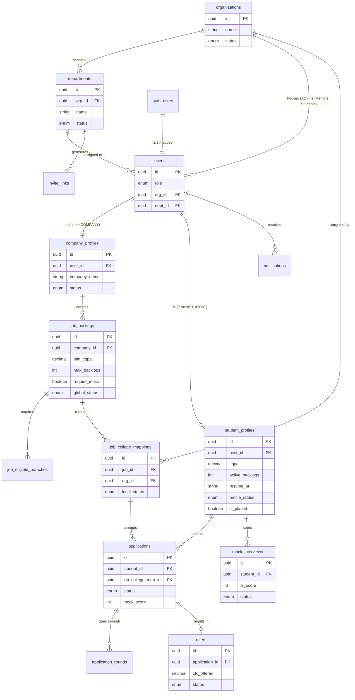

# DOCUMENT 16: ER Diagram

*Visual representation of the database schema defined in Document 15.*

```mermaid
erDiagram
organizations ||--o{ departments : "contains"
organizations ||--o{ users : "houses (Admins, Mentors, Students)"
organizations ||--o{ job_college_mappings : "targeted by"
departments ||--o{ users : "assigned to"
departments ||--o{ invite_links : "generates"
auth_users ||--|| users : "1:1 mapped"
users ||--o| company_profiles : "is (if role=COMPANY)"
users ||--o| student_profiles : "is (if role=STUDENT)"

company_profiles ||--o{ job_postings : "creates"
job_postings ||--o{ job_eligible_branches : "requires"
job_postings ||--o{ job_college_mappings : "routed to"

student_profiles ||--o{ applications : "submits"
job_college_mappings ||--o{ applications : "accepts"

applications ||--o{ application_rounds : "goes through"
applications ||--o| offers : "results in"

student_profiles ||--o{ mock_interviews : "takes"
users ||--o{ notifications : "receives"

organizations {
    uuid id PK
    string name
    enum status
}
departments {
    uuid id PK
    uuid org_id FK
    string name
    enum status
}
users {
    uuid id PK
    enum role
    uuid org_id FK
    uuid dept_id FK
}
student_profiles {
    uuid id PK
    uuid user_id FK
    decimal cgpa
    int active_backlogs
    string resume_url
    enum profile_status
    boolean is_placed
}
company_profiles {
    uuid id PK
    uuid user_id FK
    string company_name
    enum status
}
job_postings {
    uuid id PK
    uuid company_id FK
    decimal min_cgpa
    int max_backlogs
    boolean require_mock
    enum global_status
}
job_college_mappings {
    uuid id PK
    uuid job_id FK
    uuid org_id FK
    enum local_status
}
applications {
    uuid id PK
    uuid student_id FK
    uuid job_college_map_id FK
    enum status
    int mock_score
}
offers {
    uuid id PK
    uuid application_id FK
    decimal ctc_offered
    enum status
}
mock_interviews {
    uuid id PK
    uuid student_id FK
    int ai_score
    enum status
}
```