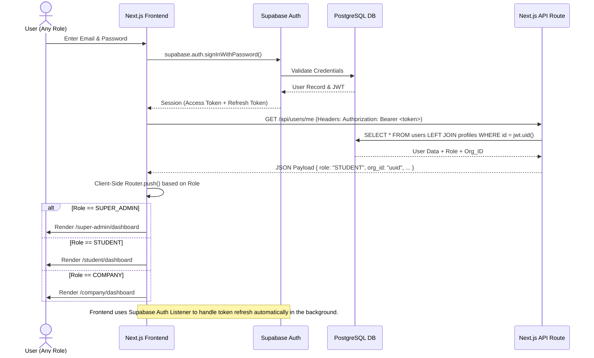

# DOCUMENT 19: Login Flow

```mermaid
sequenceDiagram
    actor U as User (Any Role)
    participant FE as Next.js Frontend
    participant Auth as Supabase Auth
    participant DB as PostgreSQL DB
    participant API as Next.js API Route

    U->>FE: Enter Email & Password
    FE->>Auth: supabase.auth.signInWithPassword()
    Auth->>DB: Validate Credentials
    DB-->>Auth: User Record & JWT
    Auth-->>FE: Session (Access Token + Refresh Token)
    
    FE->>API: GET /api/users/me (Headers: Authorization: Bearer <token>)
    API->>DB: SELECT * FROM users LEFT JOIN profiles WHERE id = jwt.uid()
    DB-->>API: User Data + Role + Org_ID
    API-->>FE: JSON Payload { role: "STUDENT", org_id: "uuid", ... }
    
    FE->>FE: Client-Side Router.push() based on Role
    alt Role == SUPER_ADMIN
        FE->>U: Render /super-admin/dashboard
    else Role == STUDENT
        FE->>U: Render /student/dashboard
    else Role == COMPANY
        FE->>U: Render /company/dashboard
    end
    
    Note over FE,Auth: Frontend uses Supabase Auth Listener to handle token refresh automatically in the background.
```