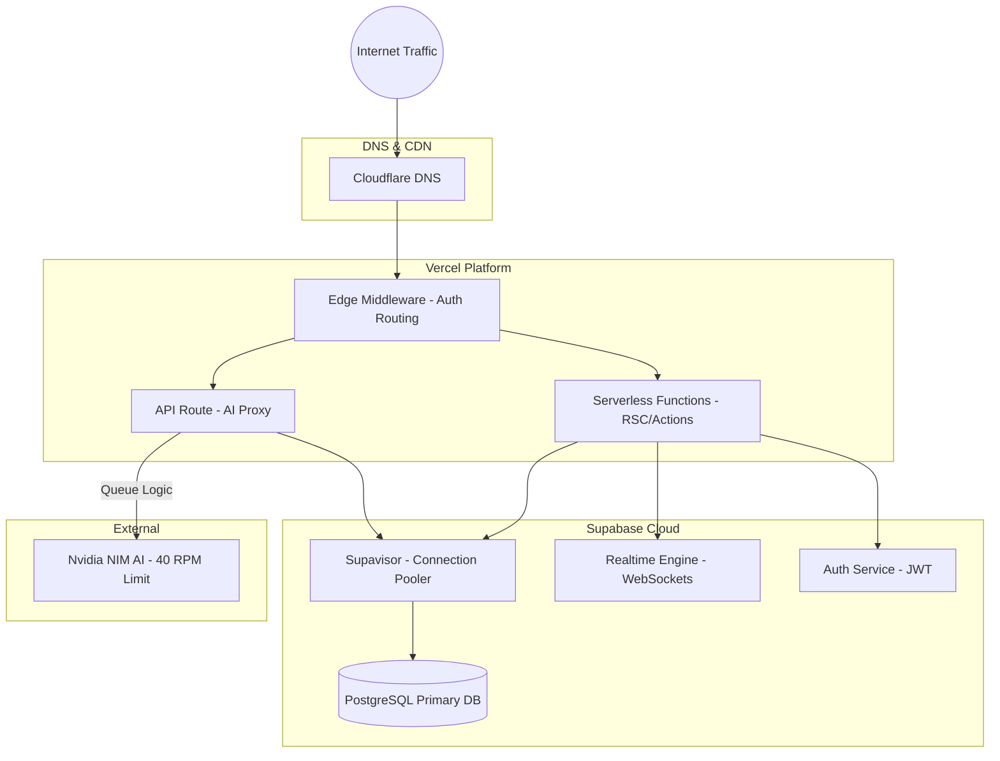

# DOCUMENT 26: Infrastructure Diagram

```mermaid
graph TD
    Internet((Internet Traffic))
    
    subgraph DNS & CDN
        Cloudflare[Cloudflare DNS]
    end

    subgraph Vercel Platform
        Edge[Edge Middleware - Auth Routing]
        SSR[Serverless Functions - RSC/Actions]
        API[API Route - AI Proxy]
    end

    subgraph Supabase Cloud
        Pool[Supavisor - Connection Pooler]
        PG[(PostgreSQL Primary DB)]
        Realtime[Realtime Engine - WebSockets]
        AuthSvc[Auth Service - JWT]
    end

    subgraph External
        Nvidia[Nvidia NIM AI - 40 RPM Limit]
    end

    Internet --> Cloudflare
    Cloudflare --> Edge
    Edge --> SSR
    Edge --> API
    
    SSR --> Pool
    API --> Pool
    Pool --> PG
    SSR --> Realtime
    SSR --> AuthSvc
    
    API -->|Queue Logic| Nvidia
```